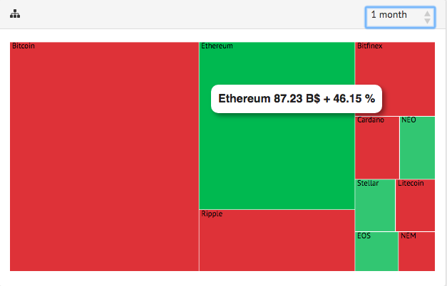
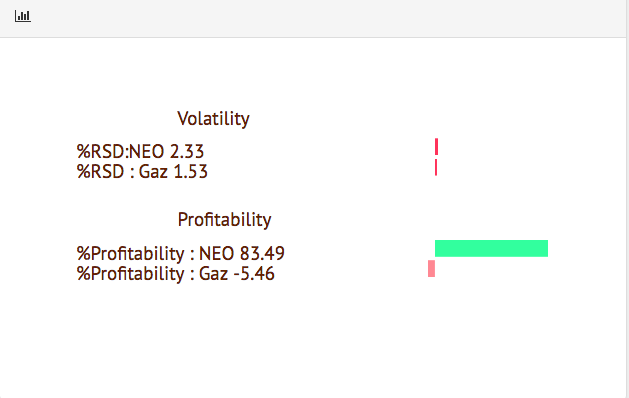

# BithWeen
Visualization of Cryptocurrencies

Investment in the CAC40 or the S&P500 does not exceed an annual profitability of 10% ! Are you impatient and want to invest elsewhere?
Welcome to our cryptocurrency visualization platform.

You'll find in a detailed and comparative cryptocurrencies visualization to guide your investment choices (Portfolio Management) :

- Cryptocurrencies Treemap in terms of capitalization by highlighting the variation by chosen period of time
- Multiple Line Chart to compare the chosen Coin with other market values (Commodities / Currencies). We highlight the profitability and the volatility (risk) of the values displayed to help the investor in his choices.
- Multiple Line Chart display of the profitability of the chosen Coin (expressed in dollars) during a certain period, we have also the possibility to choose the scale of the time that suits us (display month-15 days-1 week). The curve is displayed dynamically with synchronization with the previous Treemap.

# Context
- We have chosen to present the different cryptocurrencies because they are very different from each other, although they do not all have a physical basis. Indeed, Bitcoin is known for its specularity due to the brutal confrontation between supply and demand. The applications of Bitcoin are weak compared to Etherium which remains the best digital currency in terms of attractiveness for developers since it has many applications in different industries.
Lately, many private or state banks have decided to invest in cryptocurrencies because of the huge cash flow (transactions) that occur every day or even every minute. The return on investment in cryptocurrency was just amazing. Many people have made money, others have lost their capital, that is the law of the market.
- The investment in cryptocurrency is very complicated even for the famous traders worldwide because it is based on BlockChain technology that still actually under development. There are even those who say that the emergence of Bitcoin was "premature".
The lack of control makes possibility of exploiting the field of investment by many actors in particular those which have no knowledge in Trading (Indicators Bollingers, MACD, Charitism ...).
Indeed, it is enough to understand the global principle of the exchanges of financial assets in particular the stress of the market (balance supply and demand) in order to take the right decision. Risk is very present in this type of investment, which justifies the high risk premium or the return on investment in the digital currency market.

- So, we understand that the investment is mainly based on two aspects: the psychic linked to the risk aversion of the investor lambda. The other is based on the understanding of some simple and simple indicators: Profitability per unit of time and the volatility of the financial asset (the standard deviation of the value distribution over time of the currency in question).

 # Identification of the need and the potential market
- We  have noticed through the analysis made previously that the market includes potential investors who do not have advanced knowledge in the field of Trading (which therefore makes investment very ambiguous for them, and it is this ambiguity that generates worry, increases their stress and therefore affects their risk aversion).
 
- There is therefore a niche market that needs to intuitively understand the fundamentals of investment in cryptocurrency so as not to let this opportunity miss.

- So we decided to set up an intuitive dashboard summarizing some essential aspects to know before embarking on this adventure:

. The popularity: based on the capitalization of each digital currency, more than the currency is popular, more than if one tries to sell, there is less and less the risk that one can not find a stakeholder ( or buyer).

. Profitability: This corresponds to a historical comparison of value prices in order to identify trends in the digital currency in question. Profitability is relatively relative to the old values ​​but must also be comparable with other financial assets (Currencies & Commodities) known for their low volatility.

. Volatility: based on the standard deviation of the value share distribution, ie describes how old value quotes are distributed over time. This notion is therefore linked to the risk and stress of the stock market.

- Note: During the course of our project, we have ensured that the different values ​​displayed are standardized in order to be comparable (eliminate the effect of scale due to the difference between the prices of financial assets).

# Visualization development

 
 In this first section, we aim to expose the most attractive coins for investors. The information is based on the classification of their capitalizations in the market while this rank provides an idea about their popularity among investors worldwide.
Therefore, the treemap visualization seemed to be the best form of representation of this data as it provides many applications of color palettes, coloring and sizing metrics. So for investors to have a bigger picture, the higher the capitalization's value is, the bigger area of the treemap's cryptocurrency has. As when it comes to colors, we have decided to use red color for negative variations (the cryptocurrency's value has decreased during a period of time) and green for the positive ones and the user can choose to visualize these variations during a specific period of time (a week, 2 weeks or a month). 

 This line chart represents the profitability on each cryptocurrency, this way of representations highlights the variation of the profitability which gives an idea about the period when the coin had a certain behaviour (even positive or negative). As an example, if we take the Bitcoin cryptocurrency, we can notice that in the middle-january 2018, we notice several continuous decreases of profitability (media said that the bitcoin bubble has brusted). We used a grid in order to display the value of the profitability (that should be compared with the 0 axis). Once you hover the mouse over certain line, there is a ToolTip that displays the name of cryptocurrency, we have also the legend at bottom of the chart which is interactive. You can click on the name of the cryptocurrency in order to hide/show the line of this crypto.
 

This second line chart represents further information about commodities. Sometimes, investors are more interested in investing in commodities rather than cryptocurrencies, so that, they might lose a huge profitability that exceeds even the best shares in the classic market. There is a lot of features used in this chart like adding circles which have the same coordinate of the line chart, so that, you can just hover the mouse over it in order to display the data value (in US dollars). ToolTips that we used in the TreeMap to display the value of the capitalization of our cryptocurrencies which make it easy to understand the color of each currencies. This graph is dynamic and is synchronized with the previous graph for more interactivity, that allow to the investor to focus more on one cryptocurrency (for deep analysis).
We notice also that on the Reset button click, we display the whole coins evolutions. The legend of the coins is also interactive and allow to show/hide the coin on the click.
 

Horizontal BarChart which size and color change in function of the value of the profitability which itself depends on the period that we choose from the timespan. 
The function that computes the profitability is a ratio between (the current value minus the last value) and the last value.
The function that computes the volatility is calculated based on the expectation and the standard deviation over the last period of the study.

# Conclusion

All graphs displayed are interective and dynamic. They allow the user to take an investment decision basing of his understanding of the currency traded value evolution. The Treemap shows the capitalizations rank which gives an idea about the market activity (the bigger the capitalization is, the easier the demand and the offer could be confronted, because stakeholders would be available then and you can buy/sell easily your shares). Once we select a coin in this treemap, the evolution of the rest of the coins in the other graphs would be deleted and then we could begin our analysis. The first graph on the right displays the evolution of the profitability (the time scale can be selected for more details). This information is crucial because it provides the periods when the coin undergoes some huge variations. We know also that all cryptocurrencies are too much volatile and speculative, so, the idea is to compare their evolution with commodities (petrol,gaz..) or common coins(Euro, Livre) which are more stable, so that we can apprehend the notion of risk and profitability (the complementarity of both of them enables the particular investor to take a decision).
